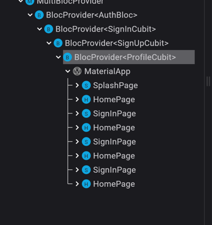

# fb_auth

### Splash Routing 문제
`SplashPage`에서 `BlocConsumer`로 `AuthState`의 상태 변화를 감지하여 로그인/로그아웃 순간에서 라우팅을 실행한다.
```dart
  @override
  Widget build(BuildContext context) {
    return BlocConsumer<AuthBloc, AuthState>(
      listener: (context, state) async {
        print('listener:: $state');
        await Future.delayed(const Duration(milliseconds: 1200));
        if (state.authStatus == AuthStatus.unauthenticated) {
          Navigator.pushNamed(context, SignInPage.routeName);
        } else if (state.authStatus == AuthStatus.authenticated) {
          Navigator.pushNamed(context, HomePage.routeName);
        }
      },
      builder: (context, state) {
        return Scaffold(
          body: Center(
            child: const CircularProgressIndicator(),
          ),
        );
      },
    );
  }
```
기존 splash routing에서는 `Navigator.pushNamed`로 라우팅 하여서 화면이 아래와 같이 계속 쌓인다.

`pushNamed`에서 `pushNamedAndUntilRemove`로 변경하여 라우팅한다. 

**Routing Sequence**
1. Not logged in (User Session is Not Alive)
   Start App -> Splash (check AuthStatus) -> Signin (login) -> Home
2. Logged In (User Session is Alive)
   Start App -> Splash (check AuthStatus) -> Home
3. Signed Out
   Home (sign out) -> (Detecting Status's Changing in BlocConsumer) Splash (check AuthStatus) -> SignIn
```text
I/flutter (22193): route.settings.name: /home
I/flutter (22193): ModalRoute: /
I/flutter (22193): route.settings.name: /signin
I/flutter (22193): ModalRoute: /
I/flutter (22193): route.settings.name: /
I/flutter (22193): ModalRoute: /
```
