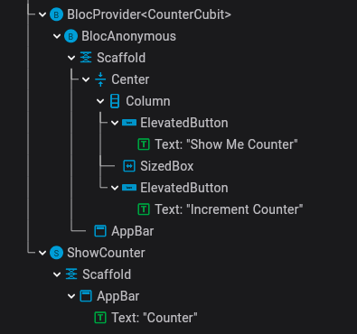
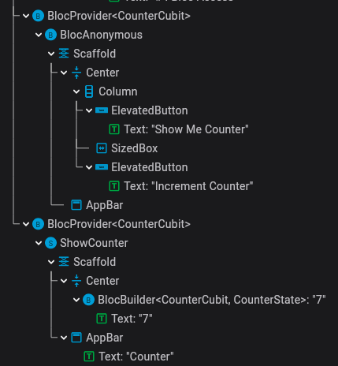

### Bloc - Anonymous Route

```
- The provider you are trying to read is in a different route.

  Providers are "scoped". So if you insert of provider inside a route, then
  other routes will not be able to access that provider.
```
Anonymous Route 시 Navigate 된 페이지는 기존 페이지 하위로 가는 것이 아니라 sibling으로 생긴다.
그렇기 때문에 context.of<T>로 찾아도 찾을 수가 없음

[displaying-a-full-screen-route](https://api.flutter.dev/flutter/widgets/Navigator-class.html#displaying-a-full-screen-route)
The route defines its widget with a builder function instead of a child widget because it will be built and rebuilt in different contexts depending on when it's pushed and popped.

Navigation 할 때 BlocProvider의 value constructor를 사용하면 라우팅된 위젯이 BlocProvider<T value>로 감사져서 context에서 value로 지정된 cubit/bloc을 사용할 수 있다.
```dart
MaterialPageRoute(
  builder: (_) {
    // return const ShowCounter();
    return BlocProvider.value(
      value: context.read<CounterCubit>(),
      child: const ShowCounter(),
    );
  },
)
```

|||
|----|----|